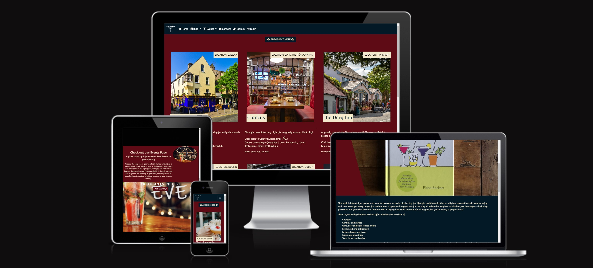
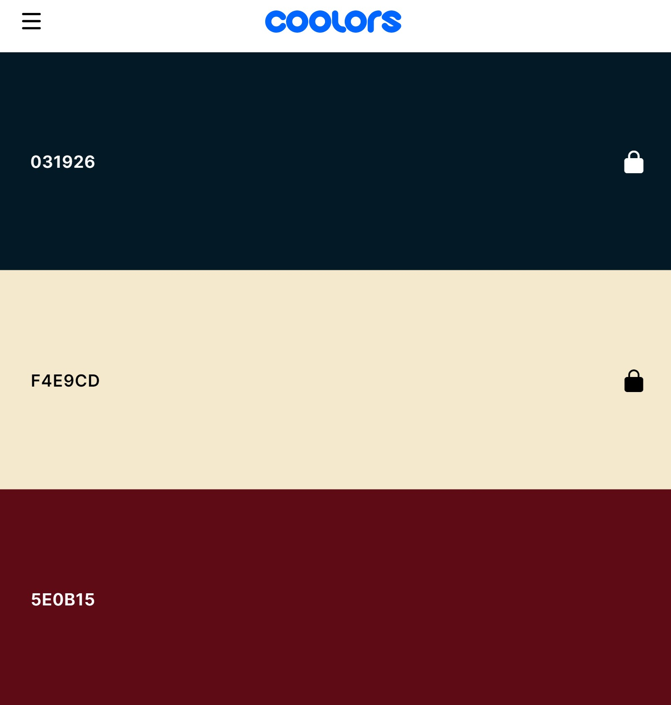
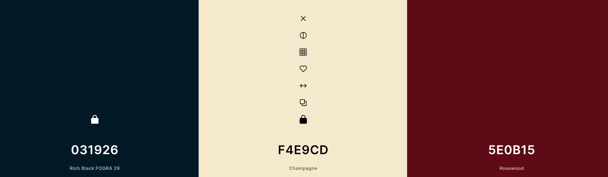
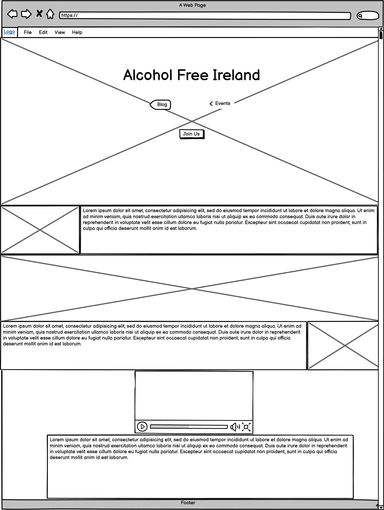
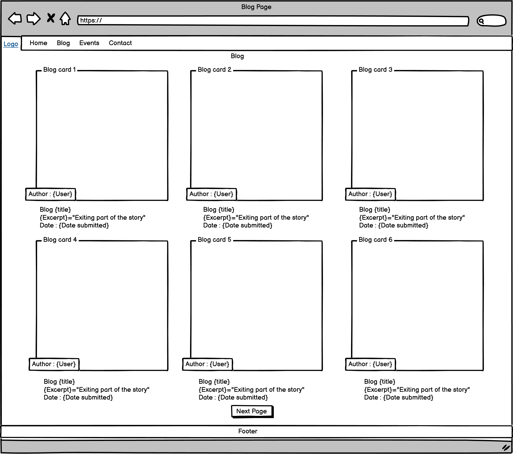
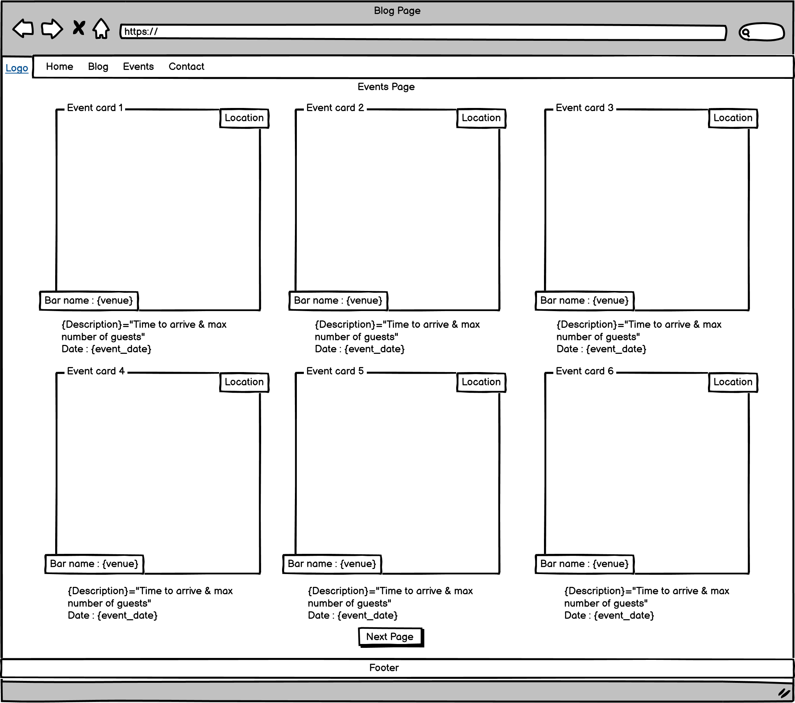
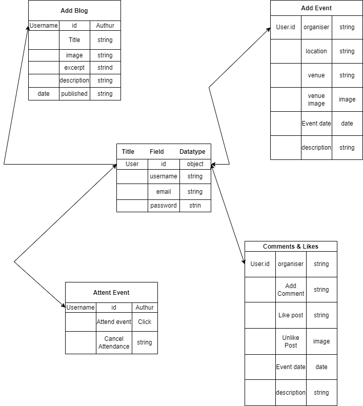

# Alcohol Free Social Drinks Ireland

## About
This website was setup to provide a platform for people who are considering taking a break from alcohol & those who don't drink alcohol. It allows people to freely share their experiences with a non-alcoholic drink lifestyle & leaves open a comments space for curious people to interact.

It is also a place for people who enjoy going out to drink non-alcoholic drinks to meet other alcohol free drinkers in their locality. 

Link to [live site](https://sober.ireland.roibeardruadhan.com/)

## **Contents**

- [**UX (User Experience)**](#ux-user-experience)
  - [**User Stories**](#user-stories)
  - [**Site Owner Goals**](#site-owner-goals)
- [**Design Choices**](#design-choices)
  - [**Colours**](#colours)
  - [**Fonts**](#fonts)
  - [**Colours**](#colours)
  - [**Imagery**](#imagery)
  - [**Wireframes**](#wireframes)
- [**Technologies**](#technologies)
  - [**Languages**](#languages)
  - [**Database**](#database)
  - [**Libraries**](#libraries)
  - [**Tools**](#tools)
- [**Features**](#features)
  - [**Site Navigation**](#site-navigation)
  - [**Features Implemented**](#features-implemented)
  - [**Future Features**](#future-features)
  - [**Database Layout**](#database-layout)
  - [**Responsive Design**](#responsive-design)
- [**Version Control**](#version-control)
- [Testing & bugs](#testing-&-bugs)
- [**Deployment**](#deployment)
  - [**Inspiration**](#inspiration)
  - [**Acknowledgements**](#acknowledgements)

## **UX (User Experience)**

### **User Stories**
- All users
    - I would like to find more information on alcohol free drinks.
    - I would like to find more information on peoples experience of replacing alcohol with a alcohol free lifestyle so that I can make a more informed decision. 
    - I would like to share my experiences of replacing alcohol with a alcohol free lifestyle so that those considering can make a more informed decision.
    - I want the site to be easy to navigate on mobile primarily so I can use it on the go.
    - I want the site to be responsive on all devices.
    - I would like to be able to comment on articles/blogs so that I can express my views to share with others
    - I would like to be able to write my own blog post to share my experience with others who may be curious
    - I would like to be able to like the posts by other Users on the website so I can express my appreciation
    - I would like to be able to arrange an event so that I can meet other people in my area who enjoy drinking alcohol free drinks
    - I would like to be able to like comments so that I can express my agreement

- As a first time user
    - I would like to be able to register with no problems and minimal information required.
    - I would like it to be able to read the articles before I register to participate.
    - I would like to be able to register via a simple process so that I can join the community.
    - I would like the navigation to be self explanotory & User friendly on all devices

### **Site Owner Goals** 
  - To allow alcohol free drinkers a space to share their positive & negative experiences with a non-alcoholic drink lifestyle.
  - To give alcohol free drinkers the opportunity to easily set up social/meetup events in their local communities.  
  - To provide a place for the approx 20% of the population who do not drink alcohol to join social meetups in their locality, as not drinking alcohol can sometimes cause them to miss out on some social interactions.

## **Design Choices**

### **Colours**
The Colours were originally an emerald green with dark mahogony frame to express an atmosphere of a dark, trendy, stylish cocktail bar. This was later evolved to it's current more modern colour's to set a modern theme to frame & express this new concept. All Colours were sourced using [Coolors](https://coolors.co/).

### **Fonts**
I used [Convergence](https://fonts.google.com/specimen/Convergence) which brings the subtlety of a bar atmosphere

### **Imagery**
The images were sourced via google images & from the website where the are article was sourced as referenced at the end of the blogs. 

### **Wireframes**
The [Home page](https://non-alc-ireland.herokuapp.com/)

The [Blog page](https://non-alc-ireland.herokuapp.com/blog/)

The [Events page](https://non-alc-ireland.herokuapp.com/events/)

## **Technologies / Languages**
- [HTML5](https://developer.mozilla.org/en-US/docs/Web/HTML)
  - Used as the main markup language for the website content.
- [CSS3](https://developer.mozilla.org/en-US/docs/Web/CSS)
  - Used to style the individual webpages.
- [Python 3](https://www.python.org/)
- [JavaScript](https://developer.mozilla.org/en-US/docs/Web/JavaScript)
    - Used to show the questions through pagination and for the game play. -->

### **Database**
- [Postgres](https://www.postgresql.org/)

### **Libraries & Frameworks**
- [Django](https://www.djangoproject.com/)
    -High level framework used for rapid development of the site.
- [Bootstrap5.0](https://getbootstrap.com/docs/5.0/getting-started/introduction/)
    -CSS Framework for developing responsive and mobile-first websites.

### **Tools**
- [Jinja2](https://palletsprojects.com/p/jinja/)
    - Jinja2 is a full-featured template engine for Python
- [Bootstrap](https://getbootstrap.com/docs/5.0/getting-started/introduction/)
    - Boostrap the world’s most popular framework for building responsive, mobile-first sites, with jsDelivr and a template starter page.
- [Google fonts](https://fonts.google.com/)
  - Used to compare and choose fonts. 
- [Favicons](https://favicon.io/)
  - Used to generate a favicon for the website title.
- [Lighthouse](https://developers.google.com/web/tools/lighthouse)
  - Used to audit the site for quality and ensure responsiveness.
- [Coolors](https://coolors.co/)
  - Used to research and choose the colour scheme by comparing and contrasting similar colours in the generator.
- [Git](https://git-scm.com/)
  - Git was used for version control (commit to Git and push to GitHub).
- [GitHub](https://github.com/)
  - Used to store, host and deploy the project files and source code after being pushed from Git. I also used it for the Project Kanban board to keep track and split tasks into smaller tasks to make them easier to fulfill.
- [Gitpod](https://www.gitpod.io/)
  - An online IDE linked to the GitHub repository used to write my code.
- [Heroku](https://www.heroku.com/home)
    - A Cloud Application Platform used to deploy the site
[Back to contents](#contents)

## **Features**
- Users can confirm they are attending an event by clicking on the large user icon underneath the event card. The number beside the 
icon will add one when clicked to confirm to the organizer the guest attendance. Counting the likes inspired this idea to resolve user attendance confirmation.
- The user is able to write their own blog & set up there own event when they are logged in.
- The user can comment on & like a blog. 
- Non users can see the events & blogs but cannot confirm attendance or write their own blog etc. 

### **Site Navigation**
- Site navigation is simplified & the same on the majority of pages stored in the base file.
- When a user is logged in the navigation will change to suit & vice versa.
- When a non user tries to write a blog or set up an event they will be directed to the sign-up form

### **Features Implemented**
- The users can like & comment on posts.
- Users can write their own blog posts
- Users can set up their own events
- Users can confirm attendance at chosen Events
- When the user scrolls the text and images animate for 3 seconds before settling in its place
#### **Features relevant to all pages** (extended via *base.html*):

- **Header**
- It also has 3 buttons, 1 to sign-up, 1 to enter the blog page & one to enter the events page.
  - **Navigation**
- Navigation is simplified using boostrap which turns into a hamburger button after a certain breakpoint for responsiveness.
- The navigation bar has drop downs for the Blog & Events options.
- The NavBar & the footer are the same colour & both using bootstrap for responsiveness
- Completed logo using Adobe

- **Hero sections**
- The header provides a welcoming atmosphere of a modern cocktail bar. The Navigation text on the Hero image for the Blog & events has a hover affect which I sourced from [developerdrive.com](https://www.developerdrive.com/8-simple-css-hover-effects/)
- **Footer** 
- The footer is a modern professional look with social network connections, navbar tools & contact links plus details
#### **Home Page** (*index.html*) 
- Animation throughout the home page on the text & images. Text & images detailing the objectives & general function of the website & all its attributes. 
#### **Log In Page** (*login.html*) & **Register** (*signup.html*)
  **Form** 
- Login & Register forms were made using the Django inbuilt form.
- Forms are decorated using bootstrap & CSS.
- Text colour changed to make clearer over background color.

#### **Add a blog** (*add_blog.html*) & **Add an Event** (*add_event.html*)
- Login & Register forms were made using the Django inbuilt form.
- All forms are decorated using bootstrap & CSS 

[Back to contents](#contents)

### **Responsive Design**
- Design was made responsive by using Django, CSS styling, Bootstrap, Devtools & many browsers for testing.

### **Future Features**
- Hopeful this will expand to become 0'0 Europe & beyond but I need to test the ground in Ireland first.
- User can confirm time & date of event via nofication if one appears in there locality.
- Event organiser can add a limit to guests in the database which I have currently tried to set at ten but not fully tested yet.
- I have been in discussions with numerous interested people to help share the concept to give it legs so that it may assert it's use case.
- Add a profile page for subscribers to allow them to make updates.
- Add a link so that users can share blogs or events on social media
- Add a way for people to register at ease using a social media account
- The images are too large on the main screen inside the blog page & need some repair work.

## **Database Layout**
- **Posts Diagram**

|     Key    |     Name     |     Type       |
| -----------| -------------| ---------------|
|            |Title(Unique) |Char(200)       |
|ForeignKey  |Author        |User model      |
|            |Created date  |DateTime        |
|            |Updated date  |DateTime        |
|            |Content       |TextField       |
|            |Featured Image|Cloudinary Image|
|            |Excerpt       |TextField       |
|Many to Many|Likes         |User model      |
|            |blog_post_id  |Integer         |
|            |Status        |Integer         |
- **Comments Diagram**

|     Key    |    Name    |     Type    |   Extra Info    |
| ---------- | -----------| ------------|-----------------|
|ForeignKey  |post        |Post model   |Cascade on delete|
|            |name        |CharField    |Max length 80    |
|            |email       |EmailField   |                 |
|            |body        |TextField    |                 |
|            |created+on  |DateTimeField|auto_now_add_True|
|            |approved    |BooleanField |default False    |

- **Database Schema Map**

[Back to contents](#contents)

## **Version Control**

- Version control was managed within GitHub and Gitpod and regular commits pushed to GitHub. See below for how this was managed:

- Gitpod Workspaces
- Starting from GitHub clone the Code Institute template by clicking Use This Template and copying to my repository under the name ms1-ali-shiatsu. The workspace is then launched by clicking GitPod - this action only needs to be performed once and then workspace reopened from GitPod.
Start the Gitpod Workspace which opens an online IDE editor window.
Gitpod branching and committing to GitHub

- I created various branches to work on different sections of code to push to master. I did this by typing into the terminal the commands: git status to find out which branch currently on; git switch -c <branchname> to create a new branch and switch to it immediately and then once the work was completed on that branch typed git add <files to be added> , git commit -m <commit message> and git push --set-upstream <remote> <branchname> to push to GitHub. I then created a pull request to pull the changes to the master if happy with the changes. From this point I would use git -d <branchname> to delete the local branch and delete the remote branch on GitHub.
Meaningful commit messages were used to allow to roll back any changes made throughout the journey.

[Back to contents](#contents)

## **Testing & bugs**
The testing process can be viewed [here](TESTING.md).

## **Deployment**
### Github
The project was developed using [GitPod](https://gitpod.io/) and pushed to [GitHub](https://github.com/) then deployed on Heroku using these instructions:

1. Create a requirements.txt file using command *pip3 freeze --local > requirements.txt*
2. Create a Procfile with the terminal command *echo web: python app.py > Procfile* and at this point checking the Procfile to make sure there is no stray line as this can cause issues when deploying to Heroku.
3. The new requirements file and Procfile committed to GitHub.
4. New app created in Heroku by clicking "New" and "Create New App" and giving it an original name and setting the region to closest to location.
5. From Heroku dashboard click "Deploy" -> "Deployment Method" and select "GitHub"
6. Search for GitHub repo and connect.
7. In the dashboard click "Settings" -> "Reveal Config Vars"
8. Set config vars:

### **Heroku** 

1. Login to Heroku.com and click New -> Create New App
- Add a name
- Select region
- Click Create App

2. To add the postgres database in Heroku:
In the Resources tab -> Add ons:

- Search for postgres
- Select Heroku Postgres
- Select the free option
- Click submit
3. In the gitpod environment install dj_database_url and psycopy2 packages using the commands:

pip3 install psycopy2-binary

pip3 install dj_database_url
4. Freeze these requirements into the requirements.txt file by running the following command:

pip3 freeze —local > requirements.txt

This will ensure all the dependencies currently used by the app are in the requirements.txt file.

5. Update the settings.py file by adding:

import dj_database_url
And setting up the new database settings:

    DATABASES = {
        ‘default’ = dj_databse_url.parse(‘<postgres_url>’)
    }
Comment out the original database setting for now so that we are connected to the postgres database.

6. Now run migrations for the new postgres database. First showmigrations to see that the migrations still need to be applied using

python3 manage.py showmigrations
Apply the migrations using:

    python3 manage.py migrate
7. Create a superuser:

python3 manage.py createsuperuser
8. To get the data from the original sqlite database used in Gitpod:

Reconnect to the original sqlite database in settings.py

Backup the sqlite database and load it into a db.json file using the command:

./manage.py dumpdata --exclude auth.permission --exclude contenttypes --indent 2 > db.json
9. Then connect back to the postgres database in settings.py

Load the data from the db.json file into the postgres database using the command:

  ./manage.py loaddata db.json
Then we can run the site using the postgres database.

10. Setup settings.py file to use either the sqlite database when running on gitpod or the postgres database when running on Heroku by using the following code:

If 'DATABASE_URL' in os.environ:

    DATABASES = {
        'default': dj_database_url.parse(os.environ.get('DATABASE_URL'))
    }

else:

    DATABASES = {
        'default': {
            'ENGINE': 'django.db.backends.sqlite3',
            'NAME': os.path.join(BASE_DIR, 'db.sqlite3'),
        }
    }
Ensuring the DATABASE_URL environment variable is set in the Heroku config vars.

11. Install gunicorn which acts as our webserver:
pip3 install gunicorn
And then:

pip3 freeze —local > requirements.txt
To save it in the requirements.txt file.

12. Create a Procfile and add the following code to it which tells Heroku to create a web dyno which will run gunicorn and serve our app.

Web: gunicorn <app_name>.wsgi:application
13. Initially disable collectstatic in Heroku, this can be done in the cli:

Heroku login -i

Enter Heroku login details

And run:

  Heroku config:set DISABLE_COLLECTSTATIC = 1
14. Update allowed hosts in settings.py to

ALLOWED_HOSTS = [‘<heroku_app_name>.herokuapp.com’, ‘localhost’]

15. Git add, git commit and git push files to GitHub so they are available to Heroku which will use them to build the app.

16. Initialise the Heroku git remote in the CLI:

Heroku git:remote -a <heroku_app_name>
17. Push to Heroku:
git push Heroku main
The app is now deployed via Heroku.

18. In Heroku we can now set up automatic deployments so that each time the code is pushed to github it also deploys to Heroku. In the deploy tab:
- Select Connect to GitHub, when the Github profile is displayed add the name of your repo and click search, once it finds & displays the correct repo click connect.
- Select the branch the repo is using
- Click Enable Automatic Deploys
19. In Heroku Config Vars set up a SECRET_KEY.

### **Acknowledgements**
Thank you the Tutor team enough for their incredible guidance & support throughout this project. 
To my Mentor Felipe Souza Alarcon for all their excellent advice, feedback & support. To Kasia for her endless inspiration & advice.
Many thanks to the Slack community & to the team at Code Institute for their help throughout the development process. Also a huge thank you to Mentor Gurjot for all the excellent guidance, support & feedback in the latter end of this project.
[Back to contents](#contents)