The project was tested thoroughly and the results are presented below:

## Table of contents:

 * [Validation](#validation)
    + [HTML](#html)
      - [W3C Markup Validation Service](#w3c-markup-validation-service)
    + [CSS](#css)
      - [W3C CSS Validation Service](#w3c-css-validation-service)
    + [JavaScript](#javascript)
      - [JSHint](#jshint)
    + [Python](#python)
    + [Lighthouse](#lighthouse)
      - [Desktop](#desktop)
      - [Mobile](#mobile)
  * [Testing of User stories & UX values](#testing-of-user-stories-&-ux-values)
      - [General](#general)
      - [Events](#events)
      - [Blog](#blog)
      - [Contact](#contact)
  * [Testing process](#testing-process)
    + [Manual Testing](#manual-testing)
      - [Navigation bar](#navigation-bar)
      - [Footer](#footer)
      - [Home](#home)
      - [Sign up page](#sign-up-page)
      - [Login page](#login-page)
      - [Logging out](#logging-out)
      - [Events](#events-management)
      - [Blog](#blog)
      - [Comments](#comments)
      - [Contact](#contact)
      - [CRUD Functionality](#crud-functionality)
      - [Responsiveness](#responsiveness)
      - [Browsers and devices](#browsers-and-devices)
      - [Defensive Programming](#defensive-programming)
    + [Bugs](#bugs)
      - [Fixed Bugs](#fixed-bugs)
      - [Known Bugs](#known-bugs)

## Validation

### HTML
## [HTML](https://validator.w3.org):

Some minor errors MIME errors & using the drop down ID more than once on my Navbar

The rest of the issues are related to Templating{}

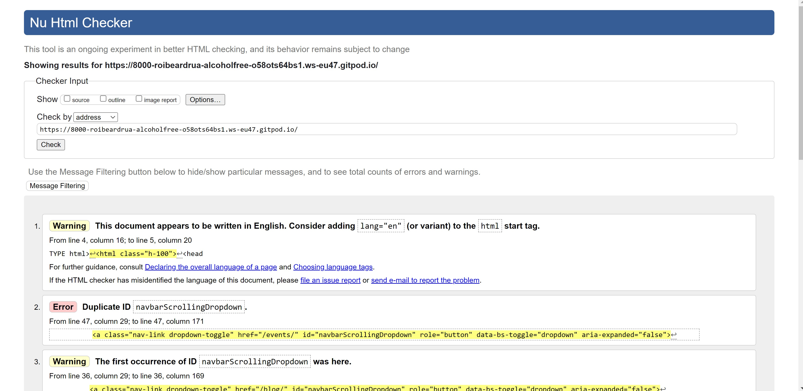

### CSS

#### W3C CSS Validation Service

* [W3C CSS Validation Service](https://jigsaw.w3.org/css-validator/) was used to validate the CSS of the project. As well as showing no errors when validating the projects CSS through its URI, there was also no errors when each CSS file was validated through direct input.

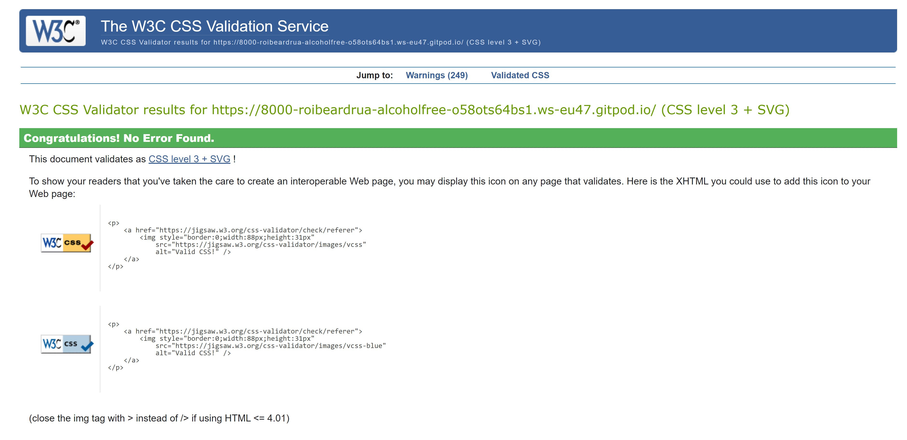

### JavaScript

#### JSHint

* All JavaScript files or snippets of JavaScript at the bottom of HTML files were validated successfully through [JSHint](https://jshint.com/).
    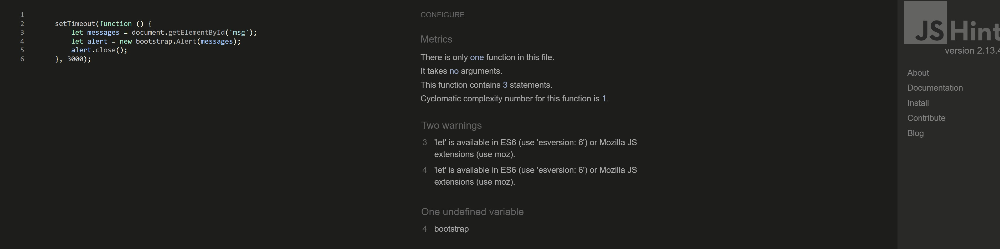

### Python

* All Python files were validated through the use of [PEP8 online](http://pep8online.com/) and all passed successfully.

    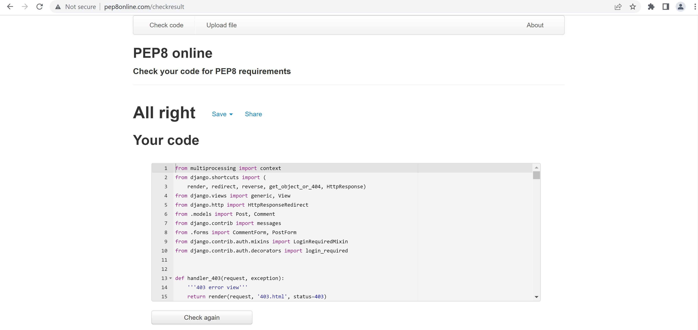

### Lighthouse

* Lighthouse was also used to test the project on both desktop and mobile.

 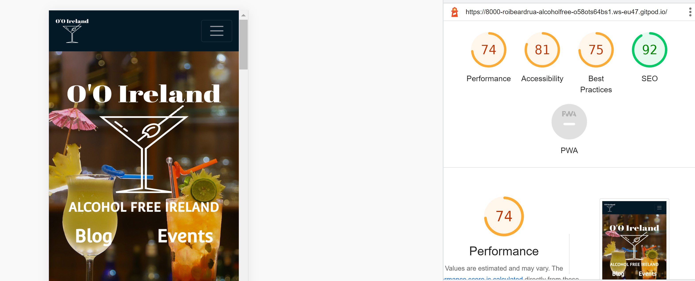

## Testing of User stories & UX value

* Starting from an unregistered customer...

    #### General
    * *As a user I can I want to be clear what the site is for so that I can avoid wasting time if it does not offer me value*

        * On arrival of the website, the user is able to understand the purpose of the website. This is due to the use of imagery, logo, the homepage content and the navigation links available to the user to visit.

        * The home page describes the content available & what it can be used for to benifit its users, in the image below the user is informed about the capabilities that become available from using a blog to express their experiences
        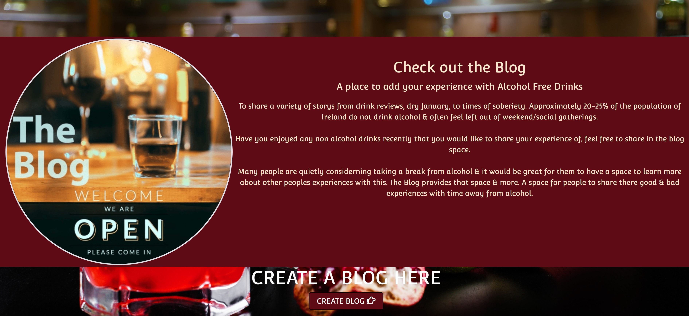
        * The image below the user is informed about the capabilities that become available from using a Events page to either join an event or to set one up in their local area 
        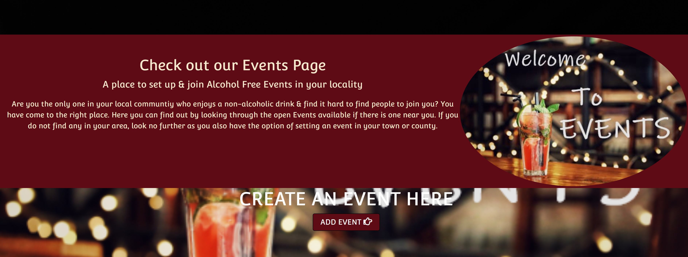
        * A description of the space is expanding & the possibilities that will exist
        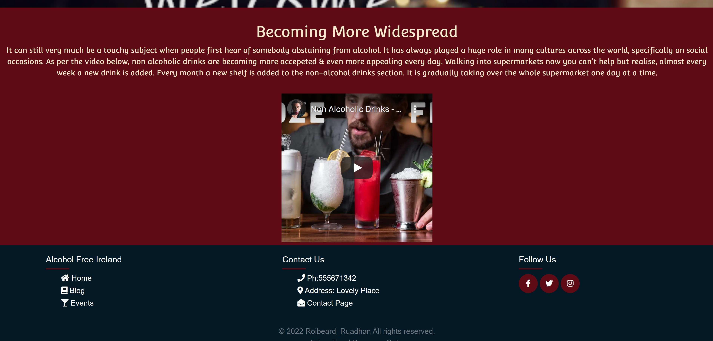

        * *As a user I can easily login or logout & receive messages to confirm the same*

        - As per the folowing images the process to login or logout two simple steps
        
        * Logged in message
        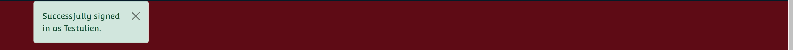
        *  Sign out confirmation page
        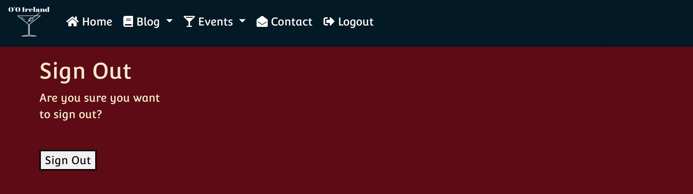
        * *As a user I can easily Signup receive messages to confirm the same*
        *  Sign up page
        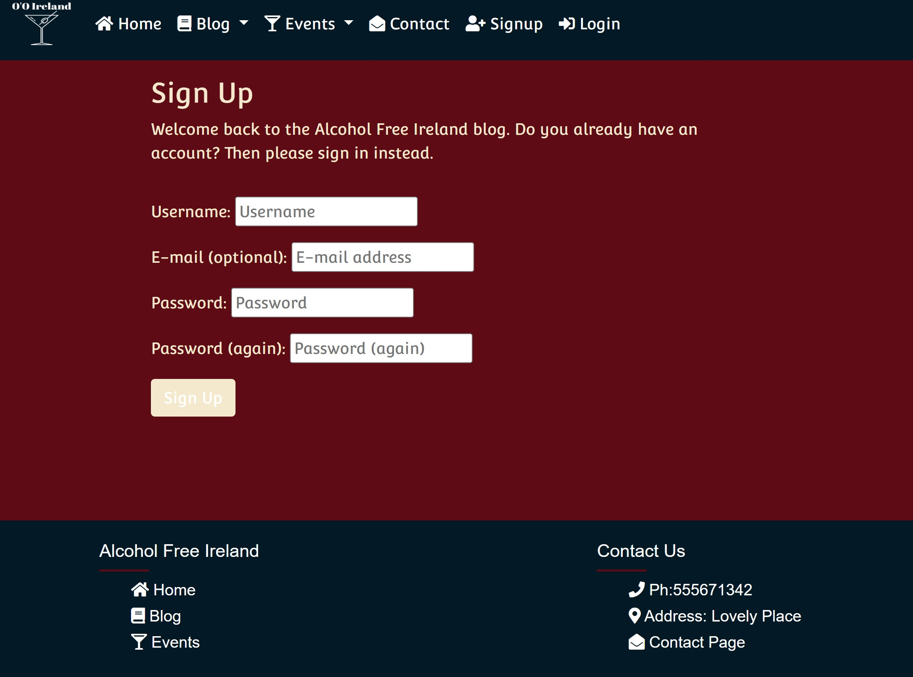
        * Confirmation user has signed out 
        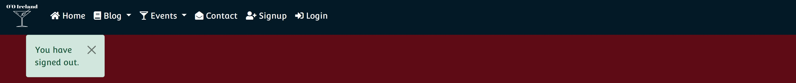
  

    ### Events
    * *As a user I would like to attend an event in my local community

        * The user can confirm attendance of the event by click on the user icon. The user icon when clicked will store the data of that users attendance & the number will rise the state the number of attendees expected. The user can remove themselves from the attendance list by clicking the user icon again.

        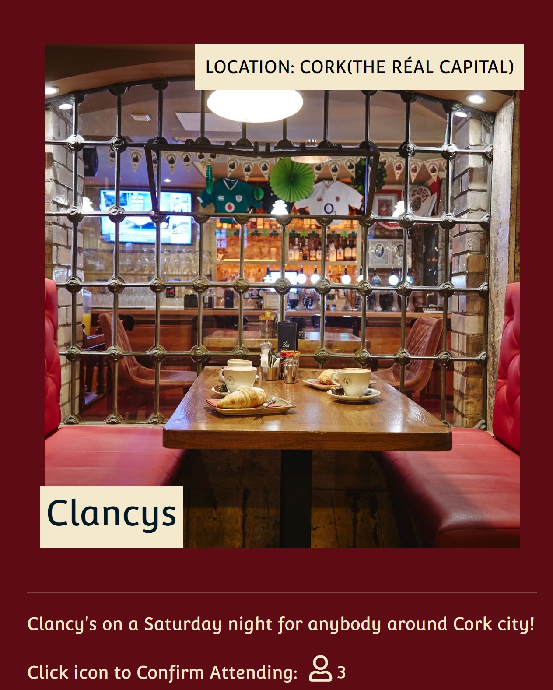

    * As I user I would like to be able to set up an event in my local area

    

    * As a user I would like to get a notification to confirm that they have received my event.

    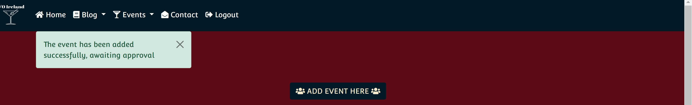

    * As the user who set up an event I would like to see the number of people attending and the names of the users attending( The names of the users attending is in production & may or may not make the cut)

    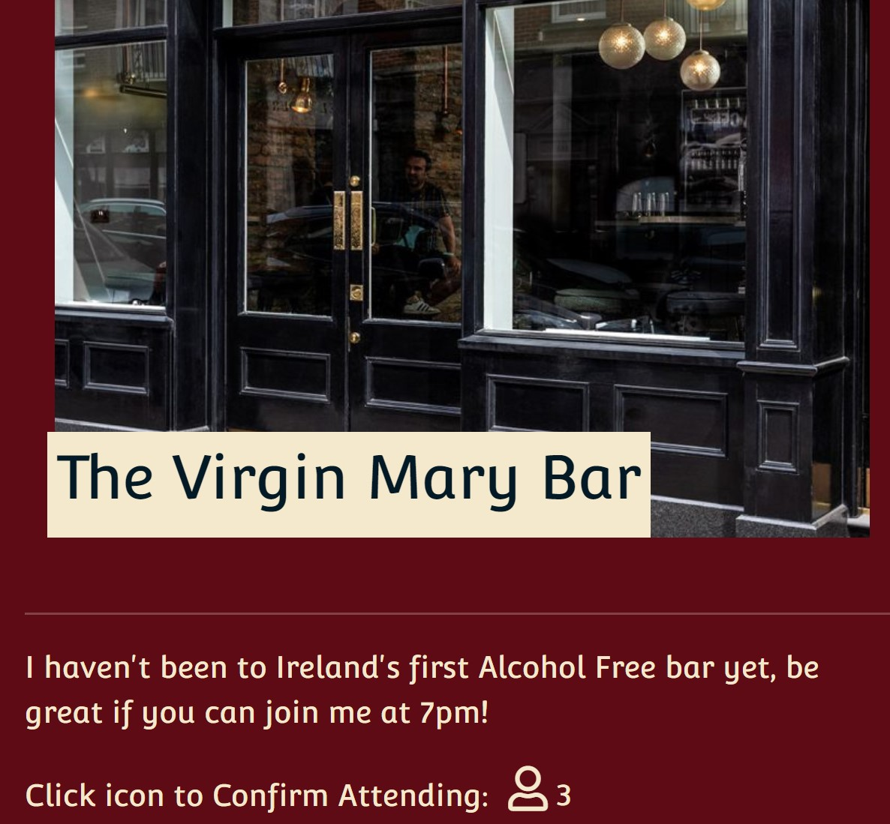

    
    * As I user I would like to be able to update or delete the event I set up

     
  

    ### Blog
    
    
    
    * *As a user/non user I can view comments on an individual post so that I can read other peoples opinion*

        * 

        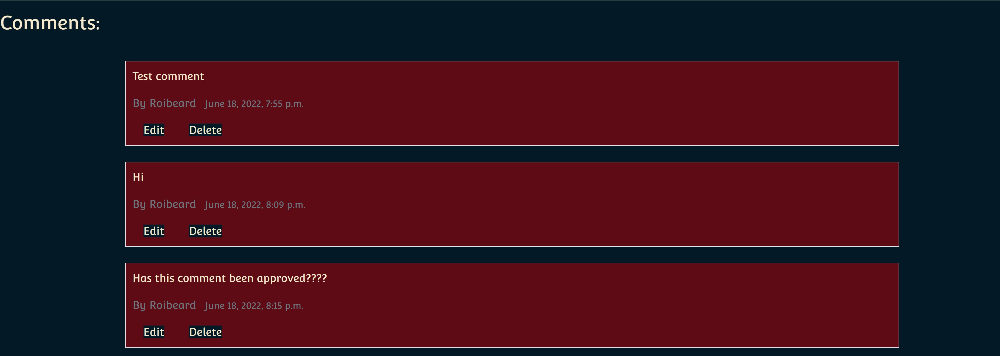

    * *As a user/non I can view a list of blogs so that I can select one to read based on the synopsis*

        * 

        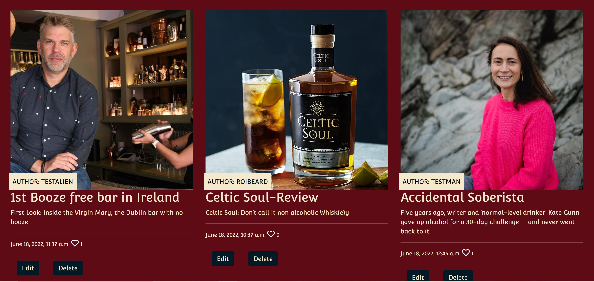

    * *As a user I can leave comments on a post so that I can be involved & received confirmation of the same*

        * 

        

      
    * *As a user I can write a blog post so that I can share my experiences & receive confirmation of the same*

        * 

        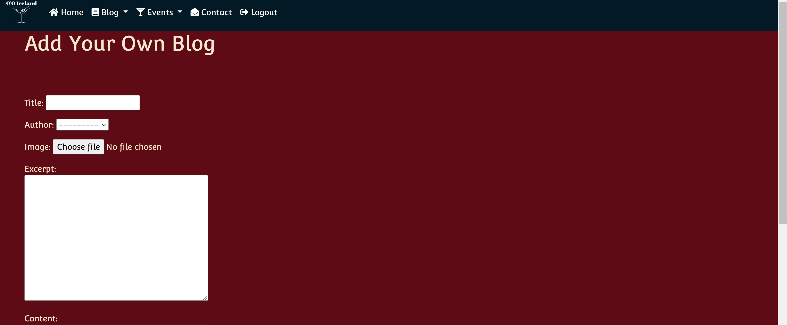

        * As I user I would like to be able to update or delete the blog I set up

    

    ### Contact

    * *As a user I can contact the website so that I can make a query*

        * 

        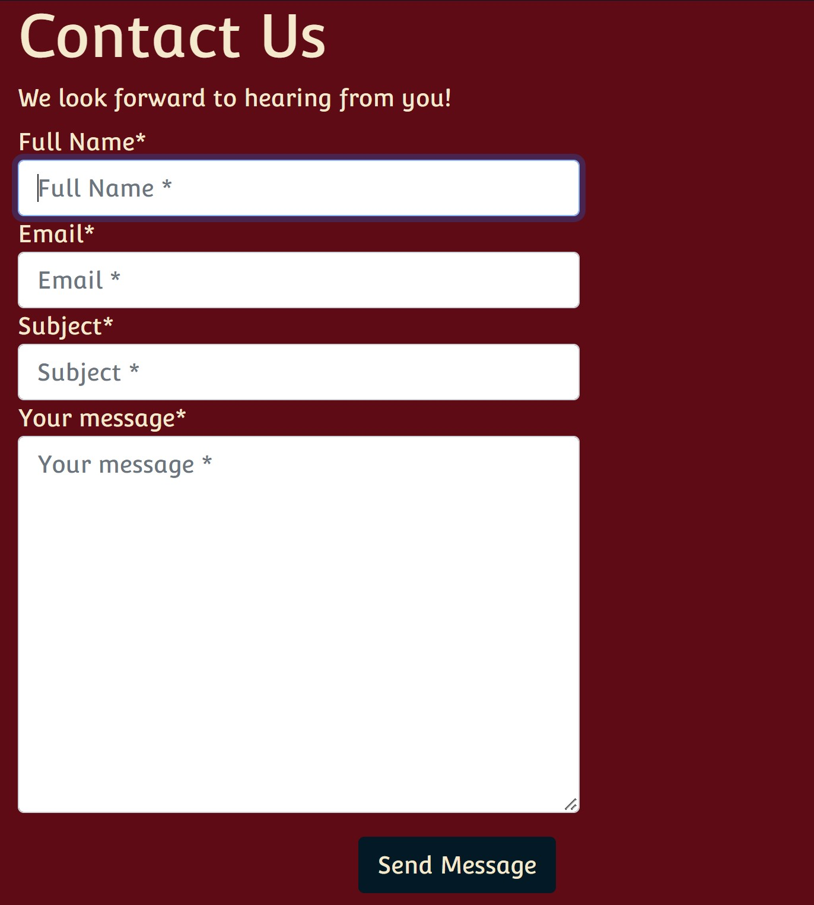
   

#### Sign up page
* The user can sign up and create an account by clicking the 'Accounts' dropdown menu on the top right. When they click on 'Sign Up' they are taken to the correct page to register. &check;
* Each form field provides a message if they have not been filled in correctly. &check;
* A notification will appear if a user has already registered with the email address they are using. &check;
* A message saying username exists will appear if the user inputs one already taken. &check;
* A 'password is too short' message appears if the user doesn't fill it in correctly. &check;
* Password 'too common will also appear when necessary. &check;
* It will show Password is 'entirely numeric. &check;
* Email is successfully sent to user when taken to verification page. &check;
* The link in the email takes the user to a page in which they can confirm verification. &check;
* Once signed up successfully, the user is redirected to login page so they can sign in with new credentials. &check;
* The link that takes the user to the login page works as intended. &check;
* All Allauth buttons works as expected. &check;

#### Login page
* A message will appear advising the user that the 'Username and/or Password specified are not correct'. &check;
* The user can sign in with a username or email. &check;
* The link that takes the user to the sign up page works as intended. &check;
* The user can reset their password by clicking on 'Forgot Password?'. It takes them to a page where they input their email address. When the user clicks on the link, they are able to change password and are advised its been successfully reset. &check;
* The form fields alert the user if they haven't input anything into each field. &check;
* All Allauth buttons works as expected. &check;

#### Logging out

* When the user is logged in they can log out by going to the 'Accounts' dropdown menu and selecting 'Log Out'. It correctly takes them to the Log out page where the user can log out. &check;
* When the user confirms they are logging out, by clicking on the 'Sign Out' button it correctly signs them out of their account withh a messge confirming. &check;

#### Contact

* All form fields show a message if nothing is inputted into them or its content is not valid and stops the user submitting the form until it is valid. &check;
* A toast also appears on successful submission telling the user, 'Alcohol-Free Shop' will be in touch shortly. &check;
* You do not have to be a user to send a message to Alcohol-Free Shop via the contacts page 

#### CRUD Functionality

* All CRUD functionality was tested and worked as expected. &check;

#### Responsiveness
* Responsiveness work was continually worked on, some areas including the incremental & decremental buttons may need more work with alignment to be more responsive particularly on the smallest phone sizes. The subjects comments can be cut off below 350 but this can/will be resolved in time.
#### Browsers and devices
* I have constantly done test on different browsers & sent to friends & family to do the same. I made some changes in particular in the css to resolve issues on many browser using linear-gradient(footer & subject) & opacity. I found some issues on my phone but when I do the phone test on my laptop it is working ok.  

* The website was tested on the following Desktop browsers:

    * Firefox
    * Google Chrome + Mobile
    * Microsoft Edge 
    * Brave + Mobile
    * Duck Duck Go(mobile)

#### Defensive Programming

## Bugs
### Fixed Bugs
##### Bug 1
 • Placeholder image fixed in the Blog page but currently not fully functioning on the Events page. The blog page one was resolved by copying the url & adding it to the models, media & templates with using {{ media url }}.

##### Bug 2
Bug:- When updating the models user to allow efficient crud (with 'Cascade') I received the a Django error. I tried to change as much as possible to avoid deleting all data & migrations + sql but could not find another solution. Unfortunately I deleted the __init__/ pages by accident due being a late night fix. I resolved this by adding my own innit files to the apps & then running migrations again.

##### Bug 3
* My contact page would not open due to a programming error for at least a few days. Every time I went back to it I would tweet the code a bit & run migrations. Nothing seemed to work so I decided to delete the migrations file & run migrations again. when this didn't work decided to delete all migration files in the tree & make migrations again. As this did not work I tried deleting the back on from a different angle to make sure all migrations we removed. Until I finally tried : python3 manage.py migrate contact zero, which managed to clear the database for me to run migrations & resolve problem &check;
 

    